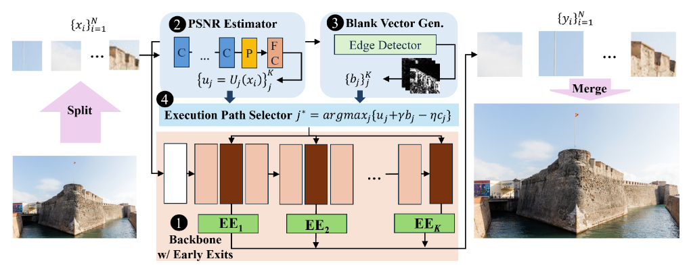
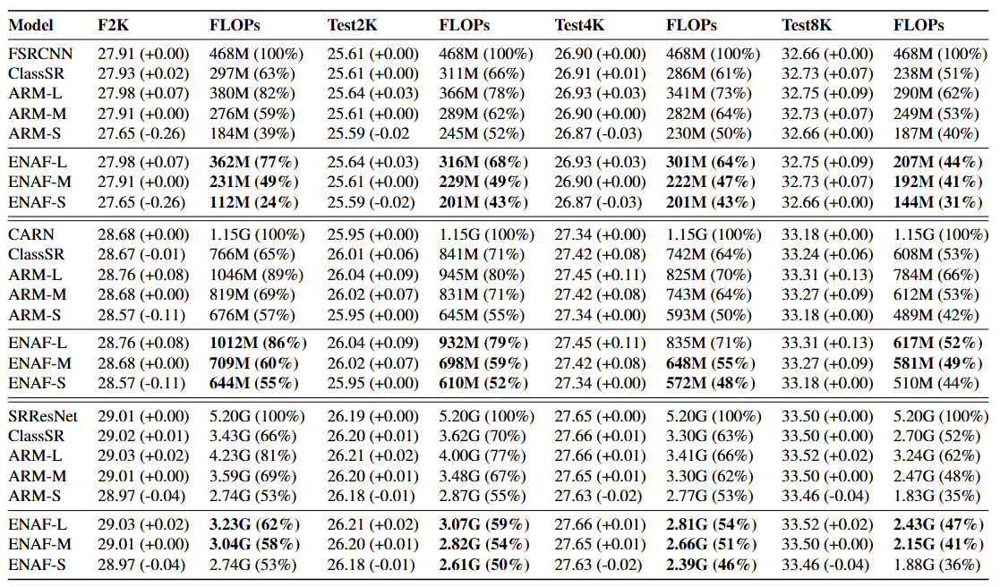
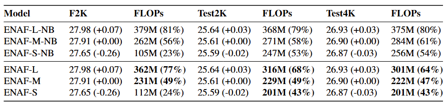

# ENAF: A Multi-Exit Network with an Adaptive Patch Fusion for Large Image Super Resolution

This is the sample source code provided for WACV 2025 submission: "ENAF: A Multi-Exit Network with an Adaptive Patch Fusion
for Large Image Super Resolution". 



### Data preparation
- The data are prepared following [ClassSR](https://github.com/XPixelGroup/ClassSR?tab=readme-ov-file)
- Raw data (DIV2K) can be downloaded from [DIV2K](https://data.vision.ee.ethz.ch/cvl/DIV2K/)
- Testing data Test2K, Test4K, Test8K can be downloaded from [Drive](https://drive.google.com/drive/folders/18b3QKaDJdrd9y0KwtrWU2Vp9nHxvfTZH?usp=drive_link)

### Pretrained weights:
- Weights are stored in [weights](./weights)

### Configuration
- Adjust configuration and weight path in folder [template](./template/)
- Importantly, notice the test data dir path.

### Inference
- Run the script placed in each network's script:
```
$ script/FSRCNN_x4/TEST/1est/fsrcnn_eunaf_test8k.sh  # FSRCNN
$ script/CARN_x4/TEST/1est/carn_eunaf_test8k.sh  # CARN
$ script/SRResNet_x4/TEST/1est/srresnet_eunaf_test8k.sh  # SRResNet
```

### Results

1. Main result on SISR performance and cost reduction.


2. Ablation study on effectiveness of PSNR estimator as early exit signal.


### Acknowledgement
- Our implementation based on [ClassSR](https://github.com/XPixelGroup/ClassSR?tab=readme-ov-file). We thank authors for their valuable contributions.

### Contact
- Email: duong.nm210243@sis.hust.edu.vn